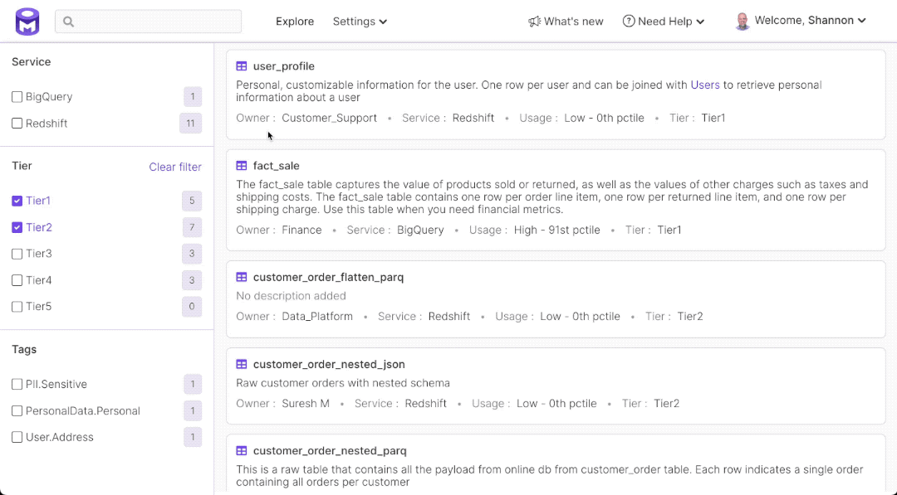

# Features

### Discover Your Data

#### Keyword Search

Find assets based on name, description, and component metadata (e.g., column name, description) and containing service

For more details see the [Asset Discovery](asset-discovery.md) documentation.

#### Complex Queries

Find assets matching strict criteria on metadata properties and Boolean operators.

For more details on asset metadata properties, please see the [Asset Discovery](asset-discovery.md) documentation.

#### Support for Complex Data Types

Add descriptions and tags to nested fields in complex data types like arrays and structs. Locate these assets using keyword search or complex queries.

### Importance and Owners

#### Filter Assets by Importance

User Tier tags and usage data to identify the relative importance of data assets.&#x20;

#### Identify Asset Owners

Identify owners who can help with questions about an asset.

### Data Lineage

Trace the path of data across tables, pipelines, and dashboards.

### Data Reliability

Build trust in your data by creating tests to monitor that the data is complete, fresh, and accurate.

#### Data Profiler

Enable the data profiler through metadata ingestion to capture the profile of tables over a period of time. This will help your users check for null values in non-null columns, for duplicates in a unique column, etc. Understand column data distributions through min, max, mean.

### Service Connectors

Integrate your database, dashboard, messaging, and pipeline services with OpenMetadata.

