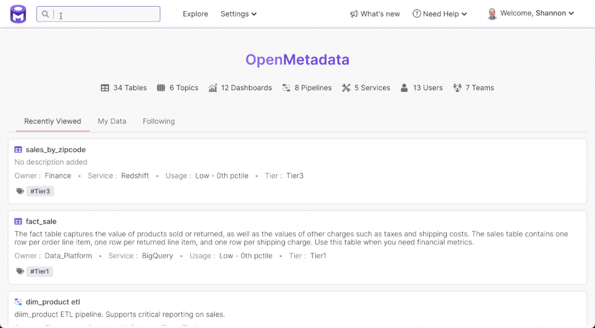

# Features

### Discover Your Data

OpenMetadata enables you to discover your data using a variety of strategies, including: keyword search, data associations (e.g., frequently joined tables, lineage), and complex queries. Using OpenMetadata you can search across tables, topics, dashboards, pipelines, and services. The OpenMetadata standard and discovery UI provides for fine-grained and detailed metadata for assets and a their components (e.g., columns, charts), including support for complex data types such as arrays and structs.

#### Keyword Search

Find assets based on name, description, component metadata (e.g., for columns, charts), and the containing service.

For more details see the documentation on [Discover Your Data.](asset-discovery.md)

#### Discover Data through Association

Discover assets through frequently joined tables and columns as measured by the data profiler. You can also discover assets through relationships based on data lineage.

#### Complex Queries

Find assets matching strict criteria on metadata properties and Boolean operators.

For more details on asset metadata properties, please see the documentation on [Discover Your Data.](asset-discovery.md)

#### Support for Complex Data Types

Add descriptions and tags to nested fields in complex data types like arrays and structs. Locate these assets using keyword search or complex queries.

### Importance & Owners

Tier tags enable you to annotate assets with their importance relative to other assets. The Explore UI enables you to filter assets based on importance.&#x20;

Use ownership metadata to determine the primary points of contact for any assets of interest in order to get help with any questions you might have.

#### Filter Assets by Importance

User Tier tags and usage data to identify the relative importance of data assets.&#x20;

.gif>)

#### Identify Asset Owners

Identify owners who can help with questions about an asset.

### Data Lineage

Trace the path of data across tables, pipelines, and dashboards.

### Data Reliability

Build trust in your data by creating tests to monitor that the data is complete, fresh, and accurate.

#### Data Profiler

Enable the data profiler through metadata ingestion to capture the profile of tables over a period of time. This will help your users check for null values in non-null columns, for duplicates in a unique column, etc. Understand column data distributions through min, max, mean.

### Service Connectors

Integrate your database, dashboard, messaging, and pipeline services with OpenMetadata.

See the [Connectors](../install/metadata-ingestion/connectors/) documentation for information on available connectors and how to integrate your services with OpenMetadata.
