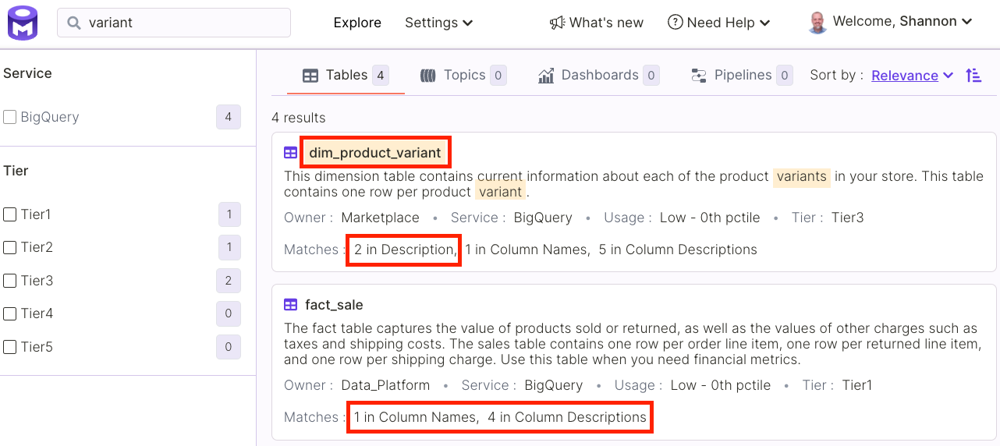
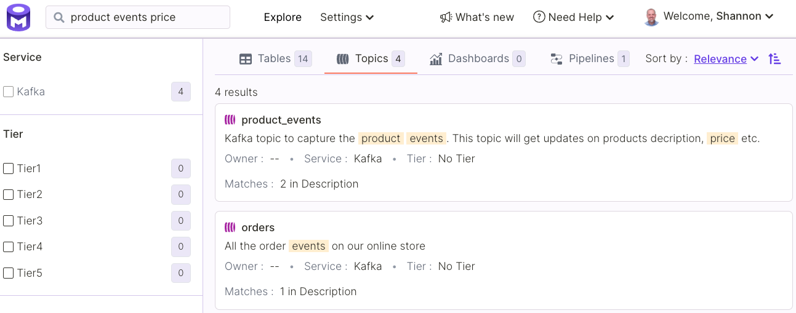
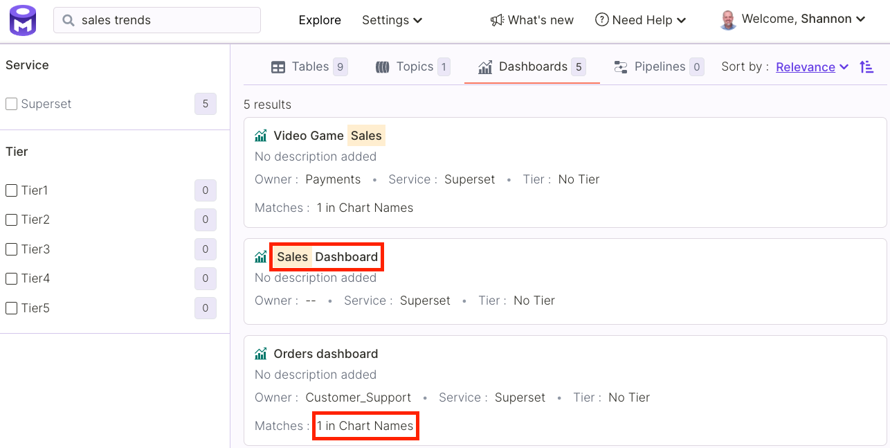
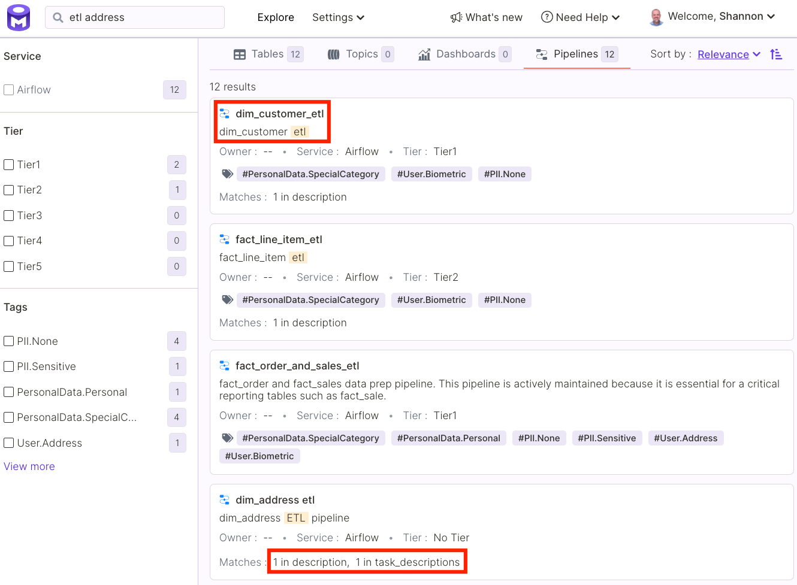
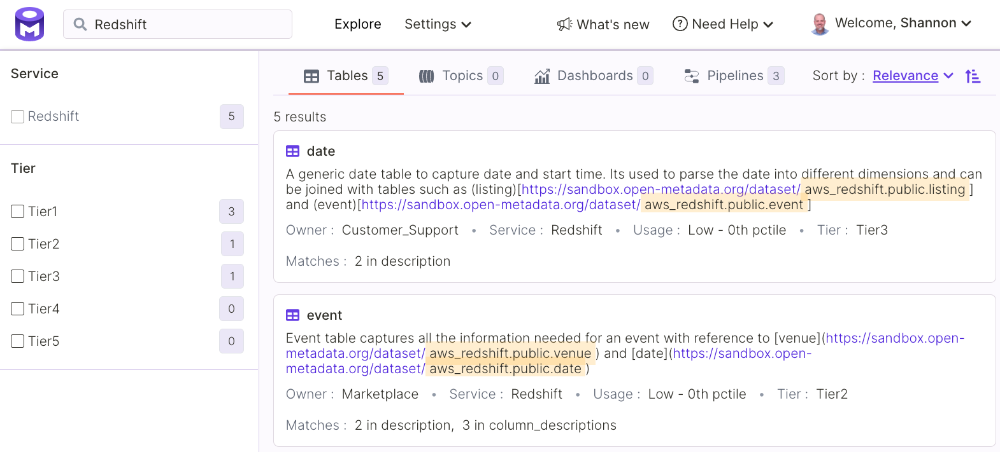
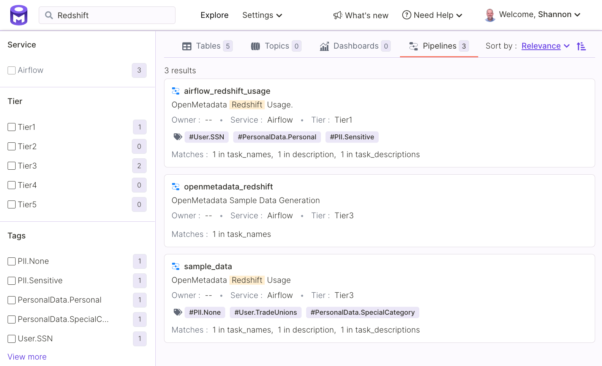
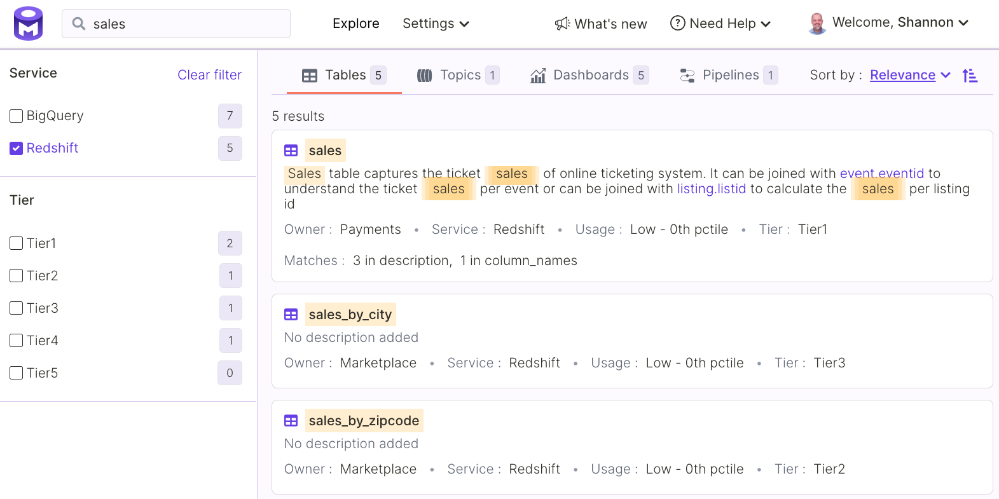
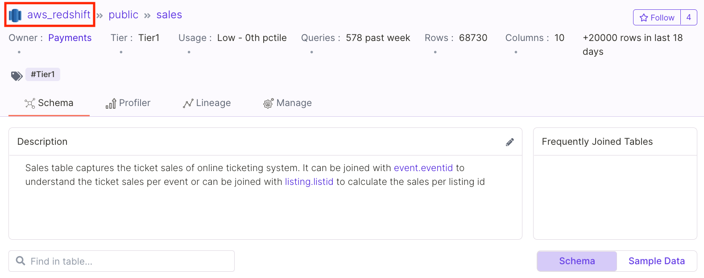

# Discover Your Data

OpenMetadata provides a search user interface (UI) that enables you to find data assets based on simple keyword queries or complex queries. The figures below provide examples of each type of query.

OpenMetadata indexes assets based on descriptive metadata. Currently, OpenMetadata indexes the following asset types.&#x20;

* Tables
* Topics
* Dashboards
* Pipelines

When you submit queries using the search UI, OpenMetadata will retrieve all assets matching the query. The search UI organizes the matching tables, topics, dashboards, and pipelines into separate tabs. See the sections below for details on discovery for each asset type.

In addition, the search UI makes services easily discoverable. The services in which assets are located are prominent throughout the discovery experience.

### Tables

OpenMetadata matches tables to queries submitted using the search UI based on the following metadata properties.

* table name
* table display name
* table description
* table owner
* table followers
* column names
* column descriptions
* database
* database service

In the example below, our search for _variant_ retrieved several tables based on matches to a variety of metadata properties. The UI specifies where matches were found using the _Matches_ label.

### Topics

OpenMetadata matches topics to search UI queries based on the following properties.

* topic name
* topic display name
* topic description
* topic owner
* topic followers
* service

In the example below, our query, _product events price_, matches several topics based on their descriptions.

### Dashboards

OpenMetadata matches dashboards to search UI queries based on the following properties.

* dashboard name
* dashboard display name
* dashboard owner
* dashboard followers
* dashboard description
* chart names
* chart descriptions
* dashboard service

In the example below, we issued a query for _sales trends_. We found five dashboards that match based on either the name of the dashboard or the names of charts the dashboard contains.

### Pipelines

OpenMetadata matches pipelines to search UI queries based on the following properties.

* pipeline name
* pipeline display name
* pipeline description
* pipeline owner
* pipeline followers
* task names
* task descriptions
* service

In the example below, our query for _etl address_ matches several pipelines based on the name, display name, pipeline description, and task descriptions.

### Services

OpenMetadata includes the service name among the properties used to index an asset. If you search by name for a service, OpenMetadata will include all assets in that service among the search results.

It will also include any assets that use the service name in other metadata, e.g., descriptions.

You may also filter search results by service. For example, in the figure below we filter the search results for the query, _sales_, so that we see only results for tables found in the Redshift database service.&#x20;

Finally, the OpenMetadata asset view displays the service in which an asset is found, enabling you locate any assets of interest or learn more about the service.

